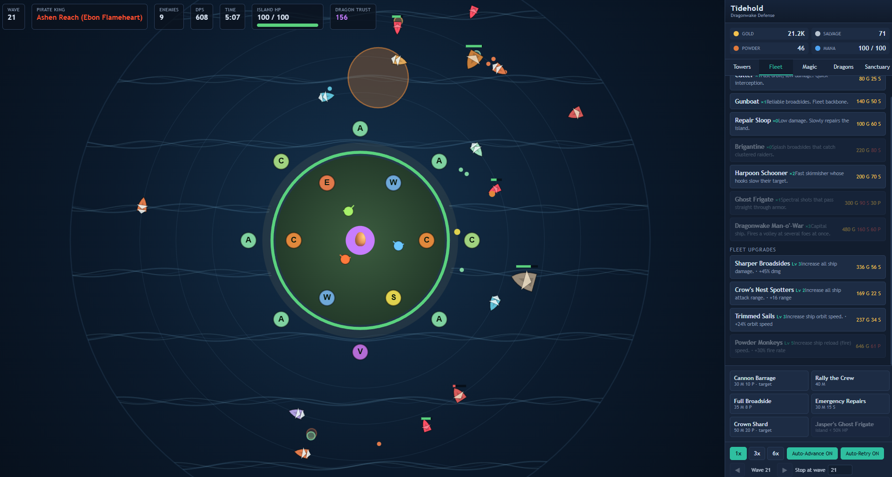

# 🐉 Tidehold: Dragonwake Defense

> A pirate-themed incremental island-defense game set in the **Shattered Seas** — build a cannon-covered fortress, surround it with a loyal fleet, rescue the last dragons, and survive endless waves from the Five Pirate Kings.

Tidehold blends **incremental progression**, **tower defense**, **fleet defense**, and **dragon-sanctuary** systems into a single dense, satisfying loop. Towers defend the land, ships circle the waters, mana abilities turn the tide, and every rescued dragon makes your sanctuary stronger.

This repository contains the **MVP prototype** — a fully playable vertical slice that proves the core loop and is architected for long-term expansion.



---

## ✨ Features

- **Canvas battlefield** — a large fortified island core, two concentric rings of **14 tower slots**, three orbit rings, a **circular HP gauge** around the shoreline, **scrolling sea swell**, enemy fleets sailing in from the sea, projectiles, splash explosions, and live range circles.
- **Directional ship art** — both enemy and friendly vessels are drawn as proper sailing ships (curved hull, deck, sails, faction ornament) and **rotate to face their direction of travel** — enemies bow-in toward the island, allies bow-first along their orbit.
- **Towers** — standard (Archer Nest, Cannon Battery, Ballista, Crossbow, Mortar, Harpoon), the range-extending Watchtower, and **magic towers** (Veilflame, Tide Engine, Storm Spire, Frost Obelisk, Ember Shrine) with status effects and support auras.
- **Per-tower upgrades & selling** — click any placed tower to open its detail panel and level its **Damage / Range / Fire Rate** independently (escalating Gold + Salvage), or **sell it for 50%** of everything you've invested to free the slot and reclaim resources.
- **Orbiting Ships** — Cutter, Gunboat, Repair Sloop, plus the Brigantine, Harpoon Schooner, Ghost Frigate, and the outer-ring Dragonwake Man-o'-War — all auto-firing as they circle.
- **4 Resources** — Gold, Salvage, Powder, and regenerating Mana.
- **Active Abilities** — Cannon Barrage (click-to-target), Rally the Crew, Full Broadside, Emergency Repairs, the forbidden Crown Shard, and **Jasper's Ghost Frigate** (a last-ditch ally summon, only when the island drops below half health), each with resource costs and cooldowns.
- **The Five Pirate King factions** — the wave bands rotate through the lore Kings: **Ashen Reach / Ebon Flameheart** (fire swarm), **Drowned Crown / Adara Thalassa** (armored leviathans), **Coiled Expanse / Mordekai Drakon** (fast serpent racers), **Black Spiral / Nimue Tideborn** (self-healing abyssal menders), and the **Goldwake Consortium / Merchant King** (reward-rich bounty galleons), each with a signature enemy, a unique **boss**, and a visible faction indicator + counter hint in the UI.
- **Counter-upgrades** — **Armor-Piercing Munitions** shred Thalassa's leviathan plate and **Tidal Nets** slow Drakon's serpent racers, applied as global tower-hit effects.
- **Dragons** — four hatchable dragons (**Blaze / Icey / Speedy / Elder**) bought by **spending Dragon Trust** (no real-time timers), each granting a distinct passive aura, with Blaze also unlocking the **Blaze Breath** active ability.
- **Enemies** — neutral raiders (Pirate Raider, Landing Skiff, Armored Brute, Egg-Runner Captain) plus **10 faction enemies** with behaviors like self-regen and ally heal-auras.
- **Endless scaling waves** — health, count, and rewards grow each wave; boss/faction banners, speed controls (1× / 3× / 6×), auto-advance, **Auto-Retry** (restart your current/highest wave to farm gold), **Next/Previous** wave stepping, and a **target-wave** stop input.
- **Data-driven content** across tabbed panels (Towers / Fleet / Magic / Dragons).
- **Dragon Sanctuary** — discover a hidden dragon egg at wave 5, claim it to begin the sanctuary, and earn **Dragon Trust** from boss kills and wave clears to hatch dragons.
- **Save / load** — versioned `localStorage` persistence with autosave and forward migrations; reload restores your entire run, including per-tower upgrade levels and hatched dragons.

---

## 🎮 How to Play

1. **Build towers.** Select a tower from the **Towers** tab, then click a glowing `+` slot on either ring of the island.
2. **Upgrade or sell individual towers.** Click any placed tower to open its detail panel — level its **Damage / Range / Fire Rate** for Gold + Salvage, or **Sell Tower** to reclaim **50%** of everything you've spent on it and free the slot.
3. **Recruit ships.** In the **Fleet** tab, buy ships that orbit and defend the waters automatically.
4. **Upgrade everything globally.** Spend Gold, Salvage, and Powder on damage, range, fire rate, mana, economy, and **counter-upgrades** (Armor-Piercing Munitions, Tidal Nets).
5. **Cast abilities.** Use mana-powered abilities at critical moments — bombard a lane, rally your defenders, repair the island, or, when the island falls **below half health**, call **Jasper Barrow's Ghost War Frigate** to fight at your side for 20 seconds.
6. **Read the enemy.** Each wave band belongs to one of the **Five Pirate Kings** (shown in the top bar and wave banner with a counter hint). Adapt your towers and counter-upgrades to the active fleet.
7. **Control the tide.** Use speed (1× / 3× / 6×), auto-advance, **Auto-Retry** to farm your highest wave, **◀/▶** to step waves between rounds, or set a **target wave** to stop at.
8. **Survive & scale.** Waves grow endlessly. A faction boss arrives every **25 waves**.
9. **Rescue & hatch dragons.** Around **wave 5**, an egg appears. Claim it to begin the sanctuary, earn **Dragon Trust** from bosses and wave clears, and **spend Trust** in the **Dragons** tab to hatch Blaze, Icey, Speedy, and Elder for permanent auras.

> **Goal:** Beneath all the cannons, gold, and fire, the true objective remains — *protect the last dragons before the world drowns again.*

---

## ☠️ The Five Pirate Kings

The Pirate Kings of the Dragonwake (see `LORE.md`) raid the sanctuary. Four of the five canonical Kings **hunt dragons** and appear as enemy factions; the fifth is the **Goldwake Consortium**, a greedy merchant-pirate fleet that profits off the dragon-egg bounty economy. The one King who *protects* dragons — **Jasper Barrow** — is not an enemy at all: he answers the player's call as the summonable **Ghost War Frigate** ability (see Abilities).

The active King rotates by wave band — each block of `WAVE.bossEvery` (default **25**) waves is themed by one King, cycling **Flameheart → Thalassa → Drakon → Tideborn → Goldwake**. The active King biases the normal spawn pool toward its signature enemy and supplies that band's boss. The top bar and wave banner show the current King, its color, and a counter hint.

| King (faction) | Theme | Signature enemy | Boss | How to counter |
| -------------- | ----- | --------------- | ---- | -------------- |
| **Ashen Reach** — *Ebon Flameheart, the Dragon Marauder* | Fire **swarm** — countless fragile ash-raiders flood the shore | Ashfire Swarmer (12 HP, very fast, no armor) | Flameheart Reaver Lord | Splash & mortar fire shred the swarm |
| **Drowned Crown** — *Adara Thalassa, Queen of Leviathans* | Slow, plated **juggernauts** that shrug off arrows | Tidal Bulwark (70 HP, **10 armor**, very slow) | Thalassa Leviathan (**16 armor**) | Armor-Piercing Munitions + Storm Spire's armor-shred cut their plate |
| **Coiled Expanse** — *Mordekai Drakon, the Sea Serpent King* | Fragile **serpent racers** that blitz the island | Serpent Racer (26 HP, **speed 70**) | Drakon Herald | Tidal Nets + Frost Obelisk slow and lock them down |
| **Black Spiral** — *Nimue Tideborn, the Kraken Caller* | Abyssal **menders** that knit their rotting kin back together | Abyssal Mender (110 HP, **regen 6/s + heal-aura 5/s**) | Tideborn Kraken (**regen 18/s**) | Burn (Veilflame) and burst damage out-pace their regen |
| **Goldwake Consortium** — *the Merchant King* | Bloated **bounty galleons** — kill them for a fat purse | Goldwake Factor (95 HP, **26 gold** reward) | Goldwake Kingpin (**260 gold**) | No gimmick — bring raw DPS and reap the bounty |

Neutral raiders also appear in every band: **Pirate Raider**, **Landing Skiff**, **Armored Brute**, and the **Egg-Runner Captain** (the first boss-type, tied to the dragon-egg event).

---

## 🏰 Towers

Towers are placed on the island's two concentric slot rings. Click a built tower to level its **Damage / Range / Fire Rate** independently, or sell it for **50%** of everything invested. Magic towers cost **Powder** and apply status effects; support towers (Watchtower, Ember Shrine) don't attack but buff neighbors.

| Tower | Family | Cost | Role |
| ----- | ------ | ---- | ---- |
| **Archer Nest** | Land | 50 g | Fast cheap single-target arrows; anti-swarm starter |
| **Cannon Battery** | Sea | 110 g · 20 s | Slow **splash** shells; strong vs groups |
| **Ballista** | Sea | 160 g · 35 s | Heavy single bolt with **2.5× boss damage** |
| **Watchtower** | Land | 90 g | No attack — **+range aura** to nearby towers |
| **Crossbow Turret** | Land | 130 g · 15 s | Bolts **pierce 3** enemies in a line |
| **Mortar Pit** | Sea | 180 g · 40 s · 10 p | Huge range (320) splash; **dead zone up close** (min range 140) |
| **Harpoon Rig** | Sea | 150 g · 30 s | Heavy bolt that **slows** its target |
| **Veilflame Spire** | Shadow | 170 g · 30 p | Spectral fire — applies **burn** DoT |
| **Frost Obelisk** | Sky | 190 g · 35 p | Chilling shards that **slow** + small splash |
| **Storm Spire** | Sky | 210 g · 40 p | Crackling bolts that **shred armor** |
| **Tide Engine** | Sea | 200 g · 30 p | Wide-**splash** water pulses |
| **Ember Shrine** | Shadow | 160 g · 25 p | No attack — **+25% damage aura** to nearby towers |

_(g = Gold, s = Salvage, p = Powder.)_

---

## ⛵ Fleet (Ships)

Ships are bought from the **Fleet** tab and auto-orbit the island on inner / middle / outer rings, firing as they circle and rotating to face their direction of travel.

| Ship | Ring | Cost | Role |
| ---- | ---- | ---- | ---- |
| **Cutter** | Inner | 80 g · 25 s | Fast orbit, low damage; quick interception |
| **Gunboat** | Middle | 140 g · 50 s | Reliable broadsides; the fleet backbone |
| **Repair Sloop** | Inner | 100 g · 60 s | Minimal damage, **slowly repairs the island** |
| **Brigantine** | Middle | 220 g · 80 s | **Splash** broadsides vs clustered raiders |
| **Harpoon Schooner** | Inner | 200 g · 70 s | Fast skirmisher whose hooks **slow** the target |
| **Ghost Frigate** | Middle | 300 g · 90 s · 30 p | Spectral shots that **ignore armor** |
| **Dragonwake Man-o'-War** | Outer | 480 g · 160 s · 60 p | Capital ship — **volley of 3**, +40% boss damage |
| **Jasper's Ghost War Frigate** | Outer | *summon only* | **Ability-summoned ally** — fast, armor-ignoring, +50% boss damage; fades after 20 s |

---

## 🚀 Getting Started

### Prerequisites
- [Node.js](https://nodejs.org/) 18+ and npm

### Installation

```bash
# Clone the repository
git clone <your-repo-url>
cd DefendIsland/Claude

# Install dependencies
npm install

# Start the dev server (http://localhost:5173)
npm run dev
```

### Available Scripts

| Command           | Description                                        |
| ----------------- | -------------------------------------------------- |
| `npm run dev`     | Start the Vite dev server with hot-module reload   |
| `npm run build`   | Type-check (strict `tsc`) and build for production |
| `npm run preview` | Preview the production build locally               |

---

## 🌐 Deploy to GitHub Pages

The repo ships with a GitHub Actions workflow at
[`.github/workflows/deploy.yml`](.github/workflows/deploy.yml) that builds the
Vite app and publishes it to **GitHub Pages** on every push to `master` (and
on-demand from the **Actions** tab).

**One-time setup:** in your repository, go to **Settings → Pages → Build and
deployment → Source** and choose **GitHub Actions**. That's it — the next push to
`master` deploys automatically.

Once deployed, the game is live at:

```
https://<your-user>.github.io/<your-repo>/
```

The workflow passes the repository name to the build as `BASE_PATH`, so Vite
emits asset URLs under the correct `/<repo>/` sub-path automatically — no manual
config needed even if you fork or rename the repo. (Locally, `npm run dev` and
`npm run preview` still serve from `/`.)

---

## 🛠️ Tech Stack

- **[React 18](https://react.dev/)** + **[TypeScript](https://www.typescriptlang.org/)** (strict mode) — UI panels
- **[Vite](https://vitejs.dev/)** — build tooling and dev server
- **HTML5 Canvas** — the real-time battlefield renderer (drawn independently of React for smooth performance)

The simulation runs on a **fixed-timestep game loop**. React UI subscribes to a throttled engine snapshot via `useSyncExternalStore`, so heavy entity rendering never triggers React re-renders.

---

## 🧱 Architecture

The codebase cleanly separates **pure game logic**, **canvas rendering**, and **React UI**.

```
src/
├── main.tsx                  # React entry point
├── App.tsx                   # Layout: canvas + panels; wires engine ↔ UI
├── game/
│   ├── GameEngine.ts         # Owns world state + fixed-timestep loop
│   ├── world.ts              # Shared mutable simulation state
│   ├── bonuses.ts            # Derives combat values from upgrades + dragon trust
│   ├── types.ts              # Shared interfaces & enums
│   ├── config.ts             # Tunable constants (scaling, costs, sizes)
│   ├── math.ts               # Vector/geometry helpers
│   ├── save.ts               # Versioned localStorage save/load
│   ├── data/                 # Data-driven definitions
│   │   ├── towers.ts
│   │   ├── ships.ts
│   │   ├── enemies.ts        # neutral + 10 faction enemies & bosses
│   │   ├── factions.ts       # the Five Pirate King faction defs
│   │   ├── abilities.ts
│   │   ├── dragons.ts
│   │   └── upgrades.ts
│   └── managers/             # One responsibility each
│       ├── ResourceManager.ts
│       ├── UpgradeManager.ts
│       ├── WaveManager.ts
│       ├── FactionManager.ts # picks the active faction by wave band
│       ├── EnemyManager.ts
│       ├── TowerManager.ts   # build / per-tower upgrades / sell
│       ├── ShipManager.ts
│       ├── ProjectileManager.ts
│       ├── AbilityManager.ts
│       └── DragonManager.ts
├── render/
│   └── BattlefieldRenderer.ts  # Pure canvas; draws the world each frame
└── ui/
    ├── useEngine.ts          # Snapshot subscription hook
    ├── GameCanvas.tsx        # Canvas element, input handling
    ├── TopBar.tsx            # Wave / enemies / DPS / time / island HP
    ├── ResourceBar.tsx
    ├── UpgradePanel.tsx      # Tabbed Towers / Fleet / Magic / Dragons
    ├── TowerDetailPanel.tsx  # Per-tower upgrades for the selected tower
    ├── AbilityBar.tsx
    ├── SpeedControls.tsx     # Speed, auto-advance, Auto-Retry, wave stepping
    ├── WaveBanner.tsx
    └── EventToast.tsx        # Dragon egg / lore events
```

### Design principles
- **Data-driven content.** Towers, ships, enemies, factions, abilities, dragons, and upgrades are plain definition objects — add new content without touching engine logic.
- **Manager pattern.** Each system is isolated and ticked by the engine — `FactionManager`, `CorruptionManager`, and `PrestigeManager` (persistent meta-progression under a separate save key) all slot into the same shared-`World` seam.
- **Rendering decoupled from state.** The canvas reads world state each frame and derives ship headings from movement; React only renders panels from a throttled snapshot.

---

## ⚙️ Tuning

Most balance knobs live in [`src/game/config.ts`](src/game/config.ts):

```ts
WAVE.bossEvery          // boss cadence + faction band length (default: every 25 waves)
WAVE.hpGrowth           // enemy HP scaling per wave (default: 1.18×)
TOWER_UPGRADE.sellRefund // fraction reclaimed when selling a tower (default: 0.5)
DRAGON_EGG_WAVE         // when the egg event triggers (default: 5)
DRAGON_TRUST_DAMAGE_BONUS // +tower damage per Trust (default: +2%)
SPEED_OPTIONS           // available speed multipliers
```

Factions rotate by wave band: `band = floor((wave-1) / WAVE.bossEvery) % 5`,
cycling Flameheart → Thalassa → Drakon → Tideborn → Goldwake. Faction defs
(signature enemy, boss, color, counter hint) live in
[`src/game/data/factions.ts`](src/game/data/factions.ts), with the canonical
Pirate King lore in [`LORE.md`](LORE.md).

Per-tower / ship / enemy / upgrade values live in the corresponding files under [`src/game/data/`](src/game/data/).

---

## 🗺️ Roadmap

The MVP is structured so these planned systems can be layered on:

- [x] Additional towers (Crossbow, Mortar, Harpoon) and **magic towers** (Veilflame, Tide Engine, Storm Spire, Frost Obelisk, Ember Shrine)
- [x] More ship classes (Brigantine, Harpoon Schooner, Ghost Frigate, Dragonwake Man-o'-War)
- [x] UX polish — larger dual-ring island, circular HP gauge, scrolling sea, per-tower upgrades + **tower selling**, and richer wave controls (Auto-Retry / Next-Prev / target-wave)
- [x] Full **dragon types** (Blaze, Icey, Speedy, Elder) — hatched by spending Dragon Trust, each with a passive aura plus the Blaze Breath ability
- [x] The **Five Pirate King** factions (rotating by wave band) with unique enemies, bosses, behaviors (regen / heal-auras), and counter-upgrades
- [x] **Directional ship graphics** with per-faction vessel variations, facing the direction of travel
- [x] **Corruption** system and forbidden **Crown Shard** power — a targeted AoE+gold ability that raises a decaying corruption meter, trading bigger damage & gold for a tougher, faster tide (with a violet sea tint + corruption chip)
- [x] **Prestige** ("Sanctuary Evacuation") — evacuate at any time to bank **Tideglass** (a milestone-gated meta-currency; only 10% if you fall in defeat), then spend it on four permanent meta-upgrades (start gold + gold, global damage, island HP, free headstart levels) that carry into every future run
- [ ] Player captains, additional resources, and automation upgrades

---

## 🌊 Lore

> The world was once balanced between **Land** (humans), **Sea** (Atlanteans), and **Sky** (dragons). That balance shattered when the Atlantean Pearl Synod tried to power a world-commanding engine — **The Crown Below** — with stolen dragon eggs. The ritual failed, the continents broke, and the seas turned hostile.
>
> You are a new captain who discovers a hidden **Tidehold**: a fortified island the Tidewardens use to shelter dragon eggs and resist the powers that broke the world. Your mission begins as survival. It becomes rescue. Eventually, it becomes repair.

The full worldbuilding document (`LORE.md`) is the narrative foundation for the
game — drop it into the project root to link it here.

---

*Built with cannons, gold, ghosts, and fire — for the last dragons.* 🐉
